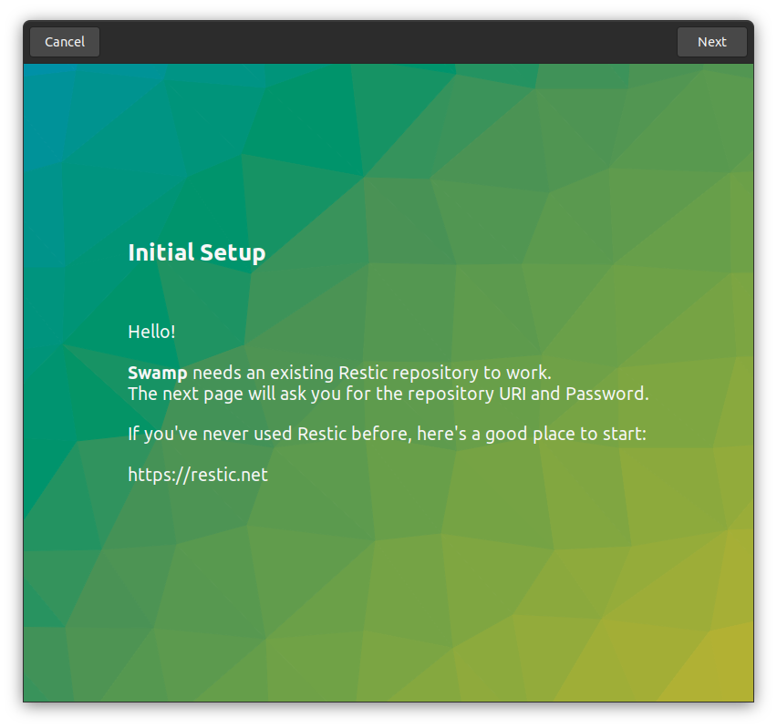
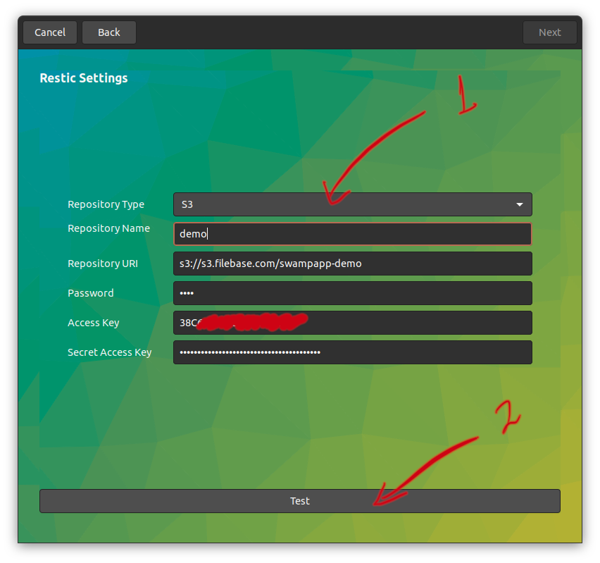
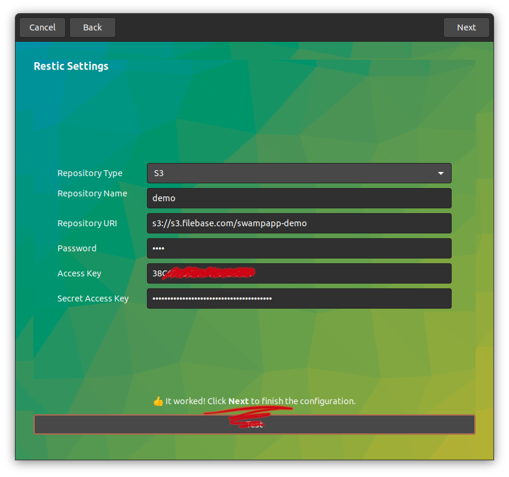
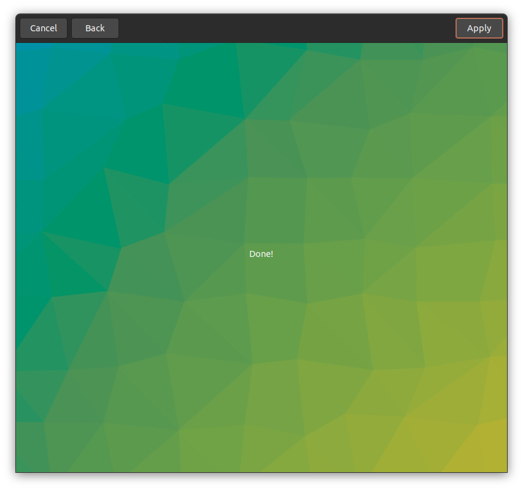
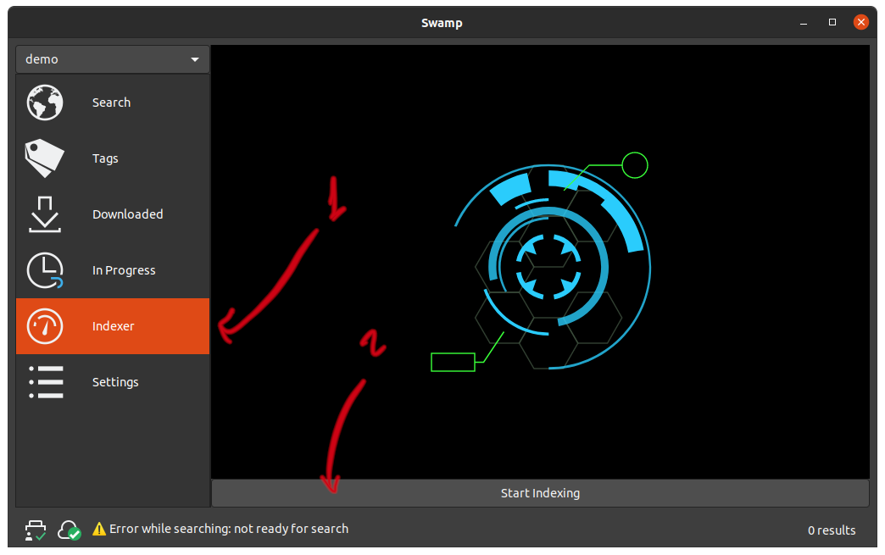

# Quick start

## Install Swamp

Install the debian package available in https://github.com/swampapp/swamp/releases.

After installing it, run the `swamp` app from the CLI or use [GNOME activities to launch it](https://help.gnome.org/users/gnome-help/stable/shell-apps-open.html.en).

## Configuration Assistant

The first time you run Swamp it'll open the assistant to guide you through the initial configuration process.

### Welcome screen

### Repository Configuration

The repository configuration is identical to the one you'd use when using [Restic's command line](https://restic.readthedocs.io/en/latest/030_preparing_a_new_repo.html), so we need to configure the repository name, password and -optionally- S3 credentials to access your repository.

Swamp 1.0.0.alpha1 only supports **local** (filesystem), **rest-server** and **S3** repositories. Support for all the repository backends supported by Restic will be added soon, before the final release.

**Note:** the repository needs to exist for Swamp to use it. Swamp doesn't know how to create or modify Restic repositories.

#### Configuring an S3 repository

Select the Repository type and fill in the details:

Click **Test** at the bottom of the screen to verify the URI, credentials, etc work as expected. Once the configuration has been validated, it'll let you move to the final screen. Click **Next** in the upper right corner.

### Done

Click **Done** in the upper right corner to finish the configuration process.

## Index the repository

Once the configuration is done, go to the **Indexer pane** and click **Index** to start indexing your repository:

Depending on your repository size, it may take from a few seconds to several hours to index your repository.

**Note:** in version 1.0.0.alpha1, Swamp will only index repositories and watch for new snapshots when the application is open.
